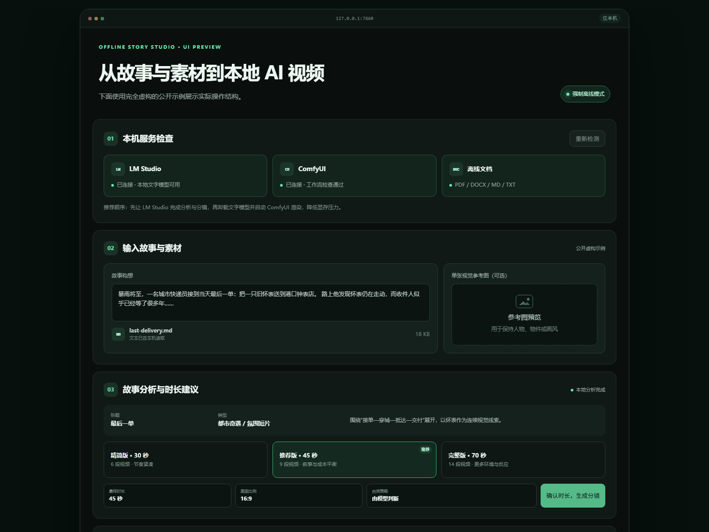

# comfyui-py-workflow

**English** | [简体中文](README.zh-CN.md)

Run, parameterize, and chain local ComfyUI API workflows from Python.

This repository focuses on execution infrastructure rather than model-routing research: load an exported API graph, replace explicit node inputs, submit it to ComfyUI, wait for completion, download artifacts, and feed one workflow's output into the next.

> This is an independent community project and is not affiliated with or endorsed by Comfy Org.

## UI preview

[](https://marsguo2049.github.io/comfyui-py-workflow/)

[Open the interactive-size static preview](https://marsguo2049.github.io/comfyui-py-workflow/). It demonstrates the local workflow with a fictional public sample and makes no uploads, model requests, or backend calls. Run `start-local-ui.bat` for the working local application.

## What it includes

- A small standard-library HTTP client for local ComfyUI.
- Image upload, prompt submission, history polling, output discovery, and artifact download.
- A two-frame chain: Z-Image Turbo → Qwen Image Edit 2509.
- A three-frame video chain: Qwen frame 3 → two MiniMax H3 first/last-frame clips → one ten-second MP4.
- API-format graphs for automation and UI-format graphs for visual editing.
- A real bicycle example with metadata-clean preview frames and final video.
- Local LM Studio story planning from text, Markdown, DOCX, and text-based PDF.
- Dynamic shot counts, model-specific prompts, and review-before-execution mode.
- MiniMax H3 FL2VA prompts with selectable automatic, disabled, or required dialogue.
- Browser-friendly fast-start MP4 output with seeking and byte-range playback.
- Optional private single-image reference input for Qwen-based scene keyframes.

## Pipeline

```text
Z-Image frame 1
  -> Qwen Image Edit frame 2
  -> Qwen Image Edit frame 3
  -> MiniMax H3 clip 1 (frame 1 to frame 2)
  -> MiniMax H3 clip 2 (frame 2 to frame 3)
  -> trim and concatenate into one ten-second MP4
```

## Quick start

Install the project with document and media support:

```powershell
python -m pip install -e ".[all]"
```

For the offline browser UI, double-click `start-local-ui.bat` on Windows or run:

```powershell
cpw-local-ui
```

The UI binds to `127.0.0.1`, accepts PDF/DOCX/Markdown/TXT plus one optional
PNG/JPEG/WebP visual reference, asks a local LM
Studio model to analyze the story and recommend a duration, requires separate
duration and storyboard confirmations, unloads the text model before rendering,
checks the local ComfyUI workflows, and shows resumable generation progress and
local media results. When a reference image is present, independent scene starts
use Qwen Image Edit instead of Z-Image; continuous shots still inherit the prior
end frame. See [the Chinese offline guide](OFFLINE_STUDIO.zh-CN.md).

Start ComfyUI at `http://127.0.0.1:8188`, install the documented models and custom nodes, then run the complete public example:

```powershell
python examples/bicycle-sequence/run.py
```

Outputs are written below `outputs/` and are ignored by Git. Use `--server` if ComfyUI is listening at a different address.

The lower-level commands are also available:

```powershell
cpw-image-sequence --help
cpw-video-sequence --help
```

## Automatic story-to-video planning

Start the LM Studio local server, then create a plan without running expensive
image or video generation:

```powershell
cpw-story-video `
  --input examples/auto-story-video/story.example.md `
  --duration 20 `
  --model "YOUR-LM-STUDIO-MODEL-ID"
```

LM Studio returns a JSON-schema-constrained plan. Python fixes the number and
duration of shots from the requested runtime; the model chooses story beats,
continuous transitions versus cuts, a visual bible, and separate prompts for
Z-Image, Qwen Image Edit, and MiniMax H3. The generated plan is written below
`outputs/story-video/plans/` for review.

After reviewing or editing the plan, start ComfyUI and execute it:

```powershell
cpw-story-video --plan outputs/story-video/plans/PLAN-ID/story-plan.json --execute
```

This two-command flow is recommended on limited-VRAM machines: close LM Studio
or unload its model before starting ComfyUI. If `--execute` is used in the same
command that creates a plan, the CLI unloads the LM Studio model through its
local API before contacting ComfyUI. Keeping both models loaded requires the
explicit `--keep-lm-loaded` flag and is not recommended for a 12 GB GPU.

Direct text is accepted with `--story`. TXT, Markdown, DOCX, and text-based PDFs
are accepted with `--input`. Long sources are summarized in local chunks before
storyboarding. Scanned PDFs require OCR because this pipeline sends extracted
text—not document page images—to LM Studio. LM Studio is restricted to a
loopback URL by default so document content is not accidentally sent to a remote
server. See [the automatic example](examples/auto-story-video/README.md).

ComfyUI alone can execute an existing `story-plan.json`, including one written
or edited manually. Its diffusion text encoders are not general chat LLMs, so
they cannot replace LM Studio for reliable document understanding and
storyboarding. Loading a full LLM through a ComfyUI custom node would consume
similar model memory while adding a more fragile dependency.

For a no-LM-Studio demonstration, run the explicitly public
[`story-plan.example.json`](examples/auto-story-video/story-plan.example.json)
directly with `--execute`.

## Workflows and models

See [workflows/README.md](workflows/README.md) for exact model filenames, directories, custom-node dependencies, and the difference between API and UI formats.

All generation prompt fields in the six committed workflow files are empty. Example prompts are stored explicitly in [`prompts.example.json`](examples/bicycle-sequence/prompts.example.json) and are injected at runtime. Model weights are never included.

## Example result

The [bicycle sequence](examples/bicycle-sequence/README.md) contains three keyframes and the final MP4. The public PNGs have no embedded ComfyUI prompt or workflow metadata.

## Relationship to workflow research

[`multi-model-workflow-optimization`](https://github.com/marsguo2049/multi-model-workflow-optimization) studies model selection, routing, evaluation, cost, latency, and resource-aware workflow optimization. This repository is a concrete ComfyUI execution backend that research systems can call; it does not contain the optimization research itself.

## Repository layout

- `src/comfyui_py_workflow`: client and reusable Python orchestration.
- `workflows/api`: prompt/API graphs consumed by Python.
- `workflows/ui`: editable ComfyUI canvas exports.
- `examples/bicycle-sequence`: runnable example and sanitized media.
- `examples/auto-story-video`: local LM Studio planning example.
- `docs`: privacy-safe static UI preview published with GitHub Pages.
- `tests`: offline client, workflow, and privacy checks.

## Tests

```powershell
python -m pip install -e ".[dev,all]"
python -m pytest
```

## License

Unless a file states otherwise, original repository content is provided under the **PolyForm Noncommercial License 1.0.0**. See [LICENSE](LICENSE).

Noncommercial use covered by that license is permitted. **Commercial use requires separate written permission from the author.**

The adapted Comfy Org workflow templates retain their MIT notice. Models, custom nodes, ComfyUI itself, and other third-party components retain their own licenses. See [THIRD_PARTY_NOTICES.md](THIRD_PARTY_NOTICES.md).
