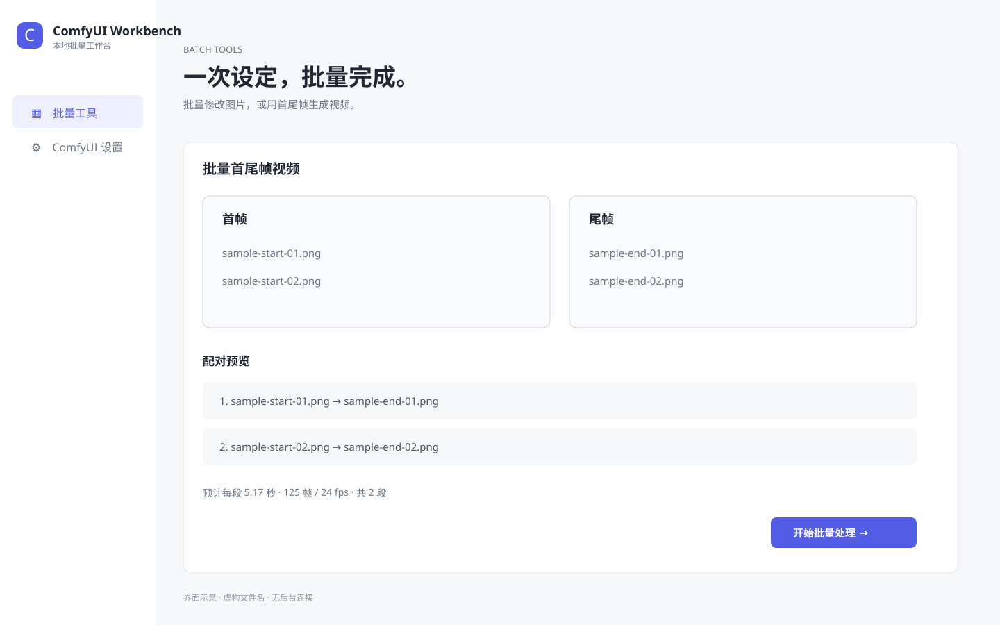

# comfyui-py-workflow

[English](README.md) | **简体中文**

用 Python 直接运行、修改参数并串联本地 ComfyUI API 工作流。项目包含一个仅绑定回环地址的 **ComfyUI Workbench**，用于批量图片编辑和批量首尾帧视频。

独立 Workbench 只连接 ComfyUI。故事视频、故事漫画、文档翻译和 LM Studio 共享设置已迁移到独立的 [Offline Studio](https://github.com/marsguo2049/offline-studio)，默认使用端口 `7870`。本仓库仍保留故事与漫画引擎的兼容 Python API。

> 这是一个独立的社区项目，与 Comfy Org 没有隶属或官方认可关系。

## ComfyUI Workbench

[](https://marsguo2049.github.io/comfyui-py-workflow/#batch)

[打开静态公开预览](https://marsguo2049.github.io/comfyui-py-workflow/#batch)。页面只使用虚构文件名，禁用上传与任务操作，并通过 `connect-src 'none'` 禁止连接后台。

Workbench 提供：

- Qwen Image Edit 批量图片任务，支持多选、文件夹和拖放；
- MiniMax H3 批量首尾帧视频，支持自然排序或同名配对；
- 上传与推理前的配对预览；
- 时长、比例、分辨率、步数、种子、超时及自定义工作流参数；
- 持久化进度与任务历史、图片下载和支持拖动播放的 MP4 字节范围响应；
- 单独保存的本机 ComfyUI 地址，不依赖 LM Studio。

## 快速开始

安装项目与可选媒体依赖：

```powershell
python -m pip install -e ".[media]"
```

在 `http://127.0.0.1:8188` 启动 ComfyUI，然后双击 `start-local-ui.bat`，或运行：

```powershell
cpw-workbench
```

Workbench 地址为 `http://127.0.0.1:7860/#batch`。任务默认保存在：

```text
outputs/comfyui-workbench/batch-jobs/<任务编号>/
```

可用 `--output-root` 指定其他任务根目录。旧版 `outputs/offline-studio/` 历史不会删除，也不会自动迁移。

详细操作见[批量图片编辑](BATCH_IMAGE_EDIT_UI.zh-CN.md)和[批量首尾帧视频](BATCH_VIDEO.zh-CN.md)。只处理自己拥有或获授权修改的媒体。

## Python 工作流与命令行

底层 ComfyUI 执行 API 和工作流示例继续保留：

```powershell
cpw-image-sequence --help
cpw-video-sequence --help
python examples/bicycle-sequence/run.py
```

单车示例生成三张关键帧和两段 MiniMax H3 视频，再拼接为十秒 MP4。结果写入 `outputs/` 并由 Git 忽略；ComfyUI 使用其他回环地址时可通过 `--server` 指定。

旧版故事规划也继续作为兼容库与命令行工作流提供：

```powershell
cpw-story-video `
  --input examples/auto-story-video/story.example.md `
  --duration 20 `
  --model "你的-LM-STUDIO-模型-ID"
```

审阅计划后执行：

```powershell
cpw-story-video --plan outputs/story-video/plans/计划编号/story-plan.json --execute
```

该命令支持直接文本、TXT、Markdown、DOCX 和文本型 PDF；扫描 PDF 需要 OCR。LM Studio 地址默认限制为回环地址。这些创作工作流的浏览器界面由 [Offline Studio](https://github.com/marsguo2049/offline-studio) 维护。

## 工作流与模型

[workflows/README.md](workflows/README.md) 列出模型文件名、目录、自定义节点依赖，以及 API/UI 两种工作流格式。提交的六份工作流图不含生成提示词，公开示例提示词在运行时注入；仓库不包含模型权重。

## 仓库结构

- `src/comfyui_py_workflow`：ComfyUI 客户端、批量引擎、可复用编排和兼容 API。
- `src/comfyui_py_workflow/web`：只包含 ComfyUI 的 Workbench 外壳与共享批量界面片段。
- `workflows/api`：Python 使用的 API 图。
- `workflows/ui`：可编辑的 ComfyUI 画布工作流。
- `examples`：可运行、已脱敏的示例。
- `docs`：隐私安全的静态 Workbench 预览。
- `tests`：离线客户端、工作流、边界和隐私检查。

## 测试

```powershell
python -m pip install -e ".[dev,all]"
python -m pytest
python scripts/build_ui_preview.py --check
```

## 许可证

除非文件另有说明，本仓库原创内容采用 **PolyForm Noncommercial License 1.0.0**，详见 [LICENSE](LICENSE)。商业使用需要单独书面许可。改编自 Comfy Org 的工作流模板保留 MIT 声明；模型、自定义节点、ComfyUI 和其他第三方组件继续使用各自许可证，详见 [THIRD_PARTY_NOTICES.md](THIRD_PARTY_NOTICES.md)。
